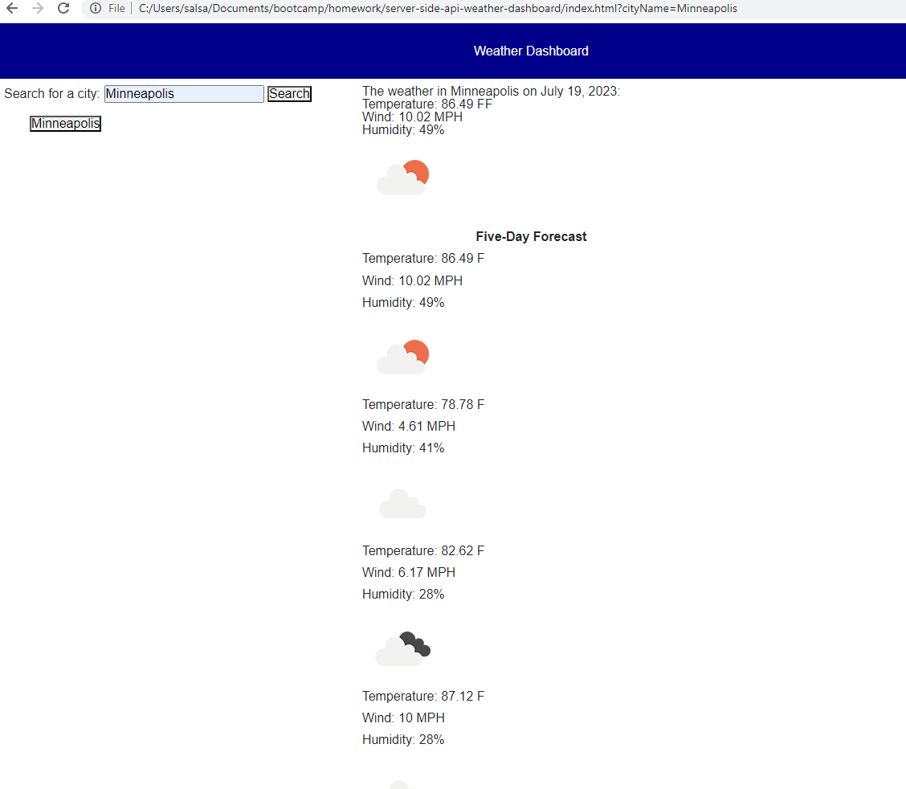

# Server Side APIs - Weather Dashboard Homework Assignment

## What I attempted to do:

Create a password calendar with typical work day hours that is color coded according to past, present, and future hour time blocks. The user can enter and save tasks for each time block.This app uses jQuery and dynamically updated HTML.

## Screen shot from one working page:

## Link to the working version of the code

https://github.com/Jacqueline-Stiehl/3p-api-work-day-scheduler-jstiehl

## URL of deployed application

https://jacqueline-stiehl.github.io/3p-api-work-day-scheduler-jstiehl/

## Acknowledgements

Tips from University of Minnesota Full Stack Bootcamp instructor Gary Almes and notes from class sessions.

Tips from class TAs: Katy Vincent and Austin Slater.

Tips from tutoring sessions with Katie Redford through University of Minnesota coding boot camp.

Tips from How to use API Keys located here: https://coding-boot-camp.github.io/full-stack/apis/how-to-use-api-keys

Tips from OpenWeather website located here: https://openweathermap.org/api
